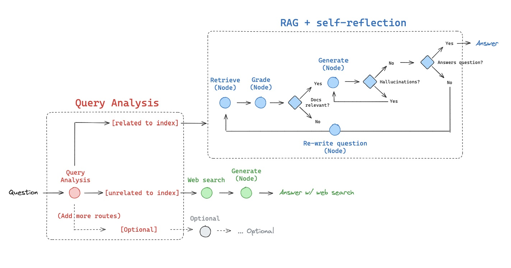
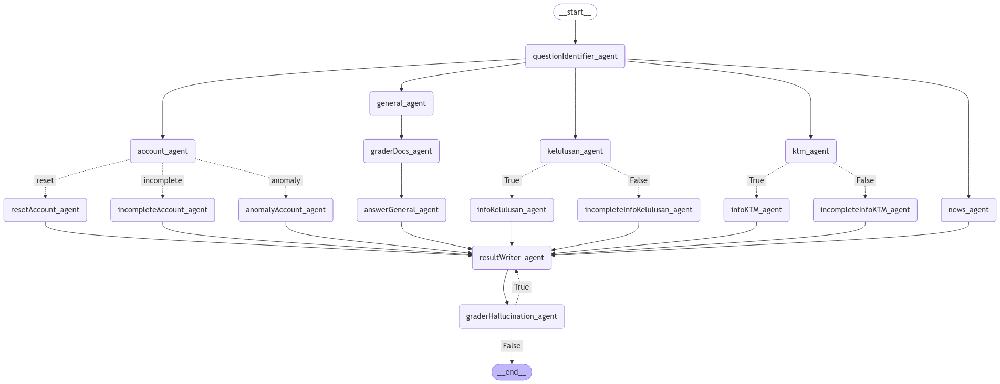

# MODEL & API SHAVIRA (GANESHA VIRTUAL ASSISTANT)

## Ringkasan

Ganesha Virtual Assistant (Shavira) adalah virtual assistant berbasis teknologi Retrieval-Augmented Generation (RAG) yang dirancang untuk membantu civitas akademika Universitas Pendidikan Ganesha (Undiksha). Shavira memiliki kemampuan untuk memberikan informasi umum terkait Undiksha. Selain itu, asisten ini juga membantu mahasiswa dalam mengakses informasi terkait perkuliahan, layanan mahasiswa, penyelesaian permasalahan akun Undiksha, dan mengikuti berita terbaru yang terjadi di lingkungan kampus. Shavira dikembangkan dengan teknologi AI canggih berbasis Web Application. Hanya dengan satu platform, civitas akademika dapat memperoleh solusi cepat dan efisien dalam memenuhi kebutuhan informasi akademik dan non-akademik di lingkungan Undiksha.

## Apa itu RAG?



Retrieval-Augmented Generation (RAG) adalah teknik yang dirancang untuk meningkatkan kinerja Large Language Model (LLM) dengan mengakses informasi dari sumber eksternal. Dengan RAG, chatbot dapat memberikan jawaban yang lebih akurat dan relevan, serta mengurangi kemungkinan halusinasi terhadap suatu informasi.

## Alur Kerja RAG

#### 1. Retrieve (Kumpulkan):

- Kueri dari pengguna digunakan untuk mencari konteks relevan dari sumber pengetahuan eksternal.
- Kuery diubah menjadi vektor dan dicocokkan dengan vektor dalam database (sumber pengetahuan juga telah melewati fase ini), sehingga mendapatkan objek data relevan (k untuk objek paling relevan).

#### 2. Augment (Tambahkan):

- Konteks diambil dan digabungkan dengan kueri pengguna menggunakan template prompt.

#### 3. Generate (Hasilkan Respon):

- Prompt yang sudah dimodifikasi struktur datanya dimasukkan ke dalam LLM untuk menghasilkan respons akhir.

## Contoh Implementasi


Pertanyaan Pengguna (Kueri) "Apa syarat untuk mendaftar sebagai mahasiswa baru di Undiksha?"

#### 1. Retrieve

Konteks relevan diambil dari database vektor.
Konteks: "Untuk mendaftar sebagai mahasiswa baru di Undiksha, calon mahasiswa harus memiliki ijazah SMA atau sederajat, melengkapi formulir pendaftaran, dan mengikuti ujian masuk."

#### 2. Augment

Gabungkan kuery pengguna dengan konteks yang diambil menggunakan template prompt.
Prompt: Pertanyaan: {question} dan Konteks: {context}"

#### 3. Generate

LLM memproses prompt tersebut untuk menghasilkan respons lengkap.
Respons Akhir: "Syarat-syarat pendaftaran mahasiswa baru di Undiksha adalah sebagai berikut: Untuk mendaftar sebagai mahasiswa baru di Undiksha, calon mahasiswa harus memiliki ijazah SMA atau sederajat, melengkapi formulir pendaftaran, dan mengikuti ujian masuk."

## Instalasi Project

Clone project

```bash
  https://github.com/odetv/va-shavira-undiksha.git
```

Masuk ke direktori project

```bash
  cd va-shavira-undiksha
```

Buat virtual environment (Opsional, jika menggunakan docker ini tidak perlu)

```bash
  pip install virtualenv
  python -m venv venv
  venv/Scripts/activate     # windows
  source venv/bin/activate  # macOS atau linux
```

Buat dan Lengkapi file environment variabel (.env)

```bash
  OPENAI_API_KEY="YOUR_OPENAI_API_KEY"
  OLLAMA_BASE_URL="YOUR_OLLAMA_BASE_URL"
  API_SSO_UNDIKSHA_AUTH_URL="AUTH_URL_API_SSO_UNDIKSHA"
  API_SSO_UNDIKSHA_USERNAME="USERNAME_API_SSO_UNDIKSHA"
  API_SSO_UNDIKSHA_PASSWORD="PASSWORD_API_SSO_UNDIKSHA"
  API_SSO_UNDIKSHA_RESPONSE_URL="RESPONSE_URL_API_SSO_UNDIKSHA"
  API_KTM_UNDIKSHA_AUTH_URL="AUTH_URL_API_KTM_UNDIKSHA"
  API_KTM_UNDIKSHA_USERNAME="USERNAME_API_KTM_UNDIKSHA"
  API_KTM_UNDIKSHA_PASSWORD="PASSWORD_API_KTM_UNDIKSHA"
  API_KTM_UNDIKSHA_RESPONSE_URL="RESPONSE_URL_API_KTM_UNDIKSHA"
  API_KELULUSAN_UNDIKSHA_AUTH_URL="AUTH_URL_API_KELULUSAN_UNDIKSHA"
  API_KELULUSAN_UNDIKSHA_USERNAME="USERNAME_API_KELULUSAN_UNDIKSHA"
  API_KELULUSAN_UNDIKSHA_PASSWORD="PASSWORD_API_KELULUSAN_UNDIKSHA"
  API_KELULUSAN_UNDIKSHA_RESPONSE_URL="RESPONSE_URL_API_KELULUSAN_UNDIKSHA"
  STREAMLIT_KEY_ADMIN="ADMIN_KEY_TO_ACCESS_DEBUG_STREAMLIT"
  VA_BEARER_TOKEN="TOKEN_FOR_BUILD_API_VIRTUAL_ASSISTANT"
  VA_LLM_SERVICE="OPENAI_OR_OLLAMA"
  VA_EMBEDDER_SERVICE="OPENAI_OR_OLLAMA"
```

## Jalankan di Development

- Run API Service (Dokumentasi: `/docs` atau `/openapipmb.json`)

```bash
  pip install -r requirements.txt
  uvicorn api.api:app
```

- Run Web Streamlit (Frontpage: `/Home` dan Backpage: `/debug`)

```bash
  pip install -r requirements.txt
  streamlit run app/Home.py
```

- Run dengan CLI di Terminal

```bash
  pip install -r requirements.txt

  # Tambahkan baris kode ini pada baris terakhir file main.py:
  run_model("Ketik pertanyaan disini")

  # Jalankan di terminal:
  python main.py
```

Contoh pertanyaan dapat dilihat disini: [example_question.txt](public/etc/example_question.txt)

## Jalankan di Production

- Deploy dengan Docker (Dokumentasi: `/docs` atau `/openapishavira.json`)

```bash
  docker compose build
  docker compose up -d
```

Atau

- Deploy Manual (Dokumentasi: `/docs` atau `/openapishavira.json`)

```bash
  pip install -r requirements.txt
  uvicorn api.api:app --host 0.0.0.0 --port XXXX --workers X
```

## Struktur Project

```
va-shavira-undiksha                     # Root directory project
├─ api                                  # API model service
│  ├─ logs
│  │  ├─ logs_activity.xlsx
│  │  └─ logs_configllm.xlsx
│  └─ api.py                            # Base code run API service
├─ app                                  # Web interface streamlit
│  ├─ .streamlit
│  │  └─ config.toml
│  ├─ pages
│  │  └─ Debug.py
│  └─ Home.py                           # Base code run web streamlit
├─ public                               # Public assets file and media
│  ├─ etc
│  │  └─ example_question.txt
│  └─ images
│     └─ any-images.jpg
├─ src                                  # Source base directory
│  ├─ agents
│  │  ├─ account_agent
│  │  │  └─ any-child-agent.py
│  │  ├─ general_agent
│  │  │  └─ any-child-agent.py
│  │  ├─ kelulusan_agent
│  │  │  └─ any-child-agent.py
│  │  ├─ ktm_agent
│  │  │  └─ any-child-agent.py
│  │  ├─ news_agent
│  │  │  └─ any-child-agent.py
│  │  ├─ grader_hallucination_agent.py
│  │  ├─ question_identifier_agent.py
│  │  └─ result_writer_agent.py
│  ├─ config
│  │  └─ config.py
│  ├─ datasets
│  │  └─ any-datasets.pdf
│  ├─ graph
│  │  └─ graph-va-shavira-undiksha.png
│  └─ vectordb
│     ├─ index.faiss
│     └─ index.pkl
├─ test                                 # Unit test evaluation RAGAS
│  ├─ config
│  │  ├─ list_qa.xlsx
│  │  ├─ rag_adaptive.py
│  │  ├─ rag_naive.py
│  │  └─ sample_case.py
│  ├─ scores_ragas
│  │  ├─ final
│  │  │  ├─ score_test_adaptive.xlsx
│  │  │  └─ score_test_naive.xlsx
│  │  ├─ score_test_adaptive.xlsx
│  │  └─ score_test_naive.xlsx
│  ├─ test_adaptive.py
│  └─ test_naive.py
├─ utils                                # Tools reusable
│  ├─ agent_state.py
│  ├─ api_undiksha.py
│  ├─ create_graph_image.py
│  ├─ debug_time.py
│  ├─ expansion.py
│  ├─ llm.py
│  ├─ logging.py
│  ├─ raw_process.py
│  ├─ scrapper_datasets.py
│  └─ scrapper_rss.py
├─ .dockerignore
├─ .env.example                         # Environment example for use
├─ .gitignore
├─ docker-compose.yaml
├─ Dockerfile
├─ main.py                              # Parrent code virtual assistant
├─ README.md
└─ requirements.txt                     # Packages dependencies project
```

## Referensi

1. [Build a ChatBot Using Local LLM](https://datasciencenerd.us/build-a-chatbot-using-local-llm-6b8dbb0ca514)
2. [Best Practices in Retrieval Augmented Generation](https://gradientflow.substack.com/p/best-practices-in-retrieval-augmented)
3. [Simplest Method to improve RAG pipeline: Re-Ranking](https://medium.com/etoai/simplest-method-to-improve-rag-pipeline-re-ranking-cf6eaec6d544)
4. [The What and How of RAG(Retrieval Augmented Generation) Implementation Using Langchain](https://srinivas-mahakud.medium.com/the-what-and-how-of-retrieval-augmented-generation-8e4a05c08a50)
5. [Retrieval-Augmented Generation (RAG): From Theory to LangChain Implementation](https://towardsdatascience.com/retrieval-augmented-generation-rag-from-theory-to-langchain-implementation-4e9bd5f6a4f2)
6. [RAG - PDF Q&A Using Llama 2 in 8 Steps](https://medium.com/@Sanjjushri/rag-pdf-q-a-using-llama-2-in-8-steps-021a7dbe26e1)
7. [RAG + Langchain Python Project: Easy AI/Chat For Your Docs](https://youtu.be/tcqEUSNCn8I)
8. [Python RAG Tutorial (with Local LLMs): Al For Your PDFs](https://youtu.be/2TJxpyO3ei4)
9. [A Survey of Techniques for Maximizing LLM Performance](https://youtu.be/ahnGLM-RC1Y)
10. [18 Lessons teaching everything you need to know to start building Generative AI applications](https://microsoft.github.io/generative-ai-for-beginners/#/)
11. [How to build a PDF chatbot with Langchain 🦜🔗 and FAISS](https://kevincoder.co.za/how-to-build-a-pdf-chatbot-with-langchain-and-faiss)
12. [How to Enhance Conversational Agents with Memory in Lang Chain](https://heartbeat.comet.ml/how-to-enhance-conversational-agents-with-memory-in-lang-chain-6aadd335b621)
13. [Memory in LLMChain](https://python.langchain.com/v0.1/docs/modules/memory/adding_memory/)
14. [RunnableWithMessageHistory](https://api.python.langchain.com/en/latest/runnables/langchain_core.runnables.history.RunnableWithMessageHistory.html#langchain_core.runnables.history.RunnableWithMessageHistory)
15. [Why Assistants API is Slow? Any speed solution?](https://community.openai.com/t/why-assistants-api-is-slow-any-speed-solution/558065)
16. [OpenAI API is extremely slow](https://github.com/langchain-ai/langchain/issues/11836)
17. [Adaptive RAG](https://langchain-ai.github.io/langgraph/tutorials/rag/langgraph_adaptive_rag/)
18. [Hands-On LangChain for LLMs App: ChatBots Memory](https://pub.towardsai.net/hands-on-langchain-for-llms-app-chatbots-memory-9394030e5a9e)
19. [How to Make LLM Remember Conversation with Langchain](https://medium.com/@vinayakdeshpande111/how-to-make-llm-remember-conversation-with-langchain-924083079d95)
20. [Conversation Summary Buffer](https://python.langchain.com/v0.1/docs/modules/memory/types/summary_buffer/)
21. [From Basics to Advanced: Exploring LangGraph](https://towardsdatascience.com/from-basics-to-advanced-exploring-langgraph-e8c1cf4db787)
22. [Build a Reliable RAG Agent using LangGraph](https://medium.com/the-ai-forum/build-a-reliable-rag-agent-using-langgraph-2694d55995cd)
23. [LangGraph](https://langchain-ai.github.io/langgraph/)
24. [Steps In Evaluating Retrieval Augmented Generation (RAG) Pipelines](https://cobusgreyling.medium.com/steps-in-evaluating-retrieval-augmented-generation-rag-pipelines-7d4b393e62b3)
25. [RAG Evaluation](https://cobusgreyling.medium.com/rag-evaluation-9813a931b3d4)
26. [Evaluating RAG Applications with RAGAs](https://towardsdatascience.com/evaluating-rag-applications-with-ragas-81d67b0ee31a)
27. [RAGAS for RAG in LLMs: A Comprehensive Guide to Evaluation Metrics](https://dkaarthick.medium.com/ragas-for-rag-in-llms-a-comprehensive-guide-to-evaluation-metrics-3aca142d6e38)
28. [Advanced RAG Techniques: What They Are & How to Use Them](https://www.falkordb.com/blog/advanced-rag/)
29. [Visualize your RAG Data - Evaluate your Retrieval-Augmented Generation System with Ragas](https://towardsdatascience.com/visualize-your-rag-data-evaluate-your-retrieval-augmented-generation-system-with-ragas-fc2486308557/)
30. [Visualize your RAG Data — EDA for Retrieval-Augmented Generation](https://itnext.io/visualize-your-rag-data-eda-for-retrieval-augmented-generation-0701ee98768f)

Developed By [DiarCode11](https://github.com/DiarCode11) & [odetv](https://github.com/odetv)
